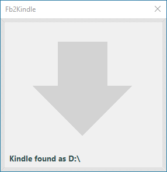

# Fb2Kindle

Simple GUI for [fb2converter](https://github.com/rupor-github/fb2converter) drag & drop files into Kindle.

## Usage

 - Download latest release of Fb2Kindle and fb2converter and unpack into one folder.
 - Create configuration file for fb2converter and place it near `fb2c.exe`.
 - Run Fb2Kindle, drag & drop any `.fb2`, `.fb2.zip` or `.epub` file.
 - Have fun time.
